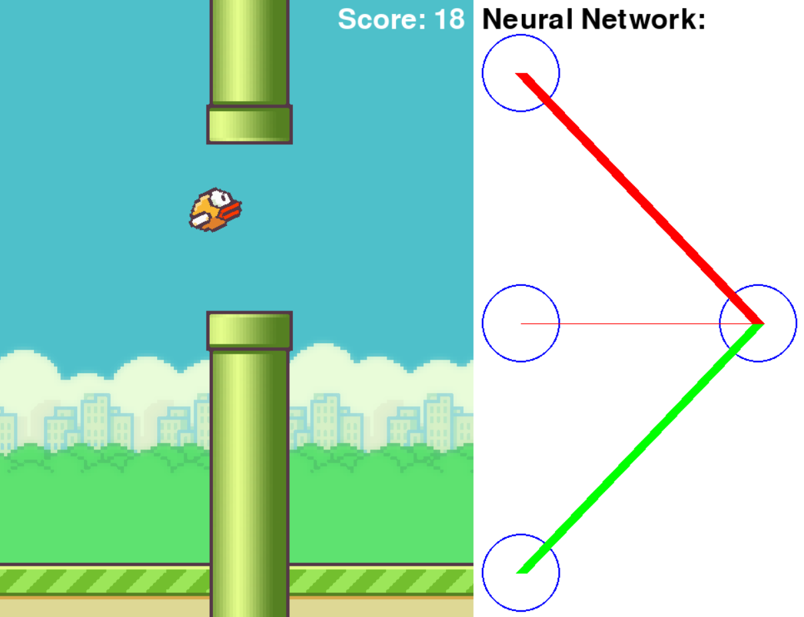

# 🐦 Flappy Bird AI (NEAT-powered)





This project recreates **Flappy Bird** in Python using **Pygame**, enhanced with **AI agents** trained via **NEAT**.

The AI learns by evolving neural networks. You can:
- Play manually
- Train an AI with NEAT
- Watch a trained AI play with a live neural-network visualization

---

## 📦 Project Structure
```
├── ai_train.py          # Train AI with NEAT
├── config_neat.txt      # NEAT configuration
├── flappy_ai.py         # Run trained AI with NN visualization
├── flappy_no_ai.py      # Play manually
├── NNetworkDisplay.py   # Draws neural network structure
├── Flap_AI.pickle       # Example trained model (binary)
├── imgs/                # Sprites: bird, pipes, background, base
└── high_score.txt       # Saved score for manual mode
```

---

## 🖼️ Images

### Gameplay (it even recods your high-score)


### AI Agent learning


---

## ⚙️ Installation

**Python 3.9+ recommended**

```bash
pip install pygame neat-python
```

> Make sure the `imgs/` folder with `bird1.png`, `bird2.png`, `bird3.png`, `pipe.png`, `base.png`, `bg.png` is present in the working directory.

---

## ▶️ Usage

### 1) Manual play
```bash
python flappy_no_ai.py
```
Controls:
- `SPACE` → jump
- `ENTER` → restart after death
- Close window → quit

### 2) Train the AI (evolution with NEAT)
```bash
python ai_train.py
```
- Adjust parameters in `config_neat.txt` (e.g., `pop_size`, mutation rates).
- The best genome is saved to **`Flap_AI.pickle`** when training completes.

### 3) Run the trained AI with visualization
```bash
python flappy_ai.py
```
- Loads **`Flap_AI.pickle`** and displays a live neural network view (via `NNetworkDisplay.py`).

---

## 🧠 Inputs to the Network
Each frame, the network receives:
1. Bird's current **y** position
2. Distance from bird to current pipe **gap center**
3. Distance from bird to **gap bottom**

Output: a single value in [0, 1]; if > 0.5 → the bird **jumps**.

---

## 🧪 NEAT Configuration
Edit **`config_neat.txt`** to tweak evolution:
- `pop_size = 50`
- `activation_options = tanh`
- `num_inputs = 3`, `num_outputs = 1`
- Mutation rates, weight ranges, stagnation, elitism, etc.

---

## 🧰 Troubleshooting
- **Black window/asset errors**: ensure `imgs/` exists with the required PNGs.
- **Pygame errors on macOS**: run with `pythonw` or install python via python.org.
- **Slow training**: lower `pop_size` or reduce `max_stagnation` in config.

---

## 📜 License
MIT.

---

## 🙏 Acknowledgments
Built with **Pygame** and **neat-python**. Inspired by popular Flappy Bird NEAT tutorials from Tech with Tim.
